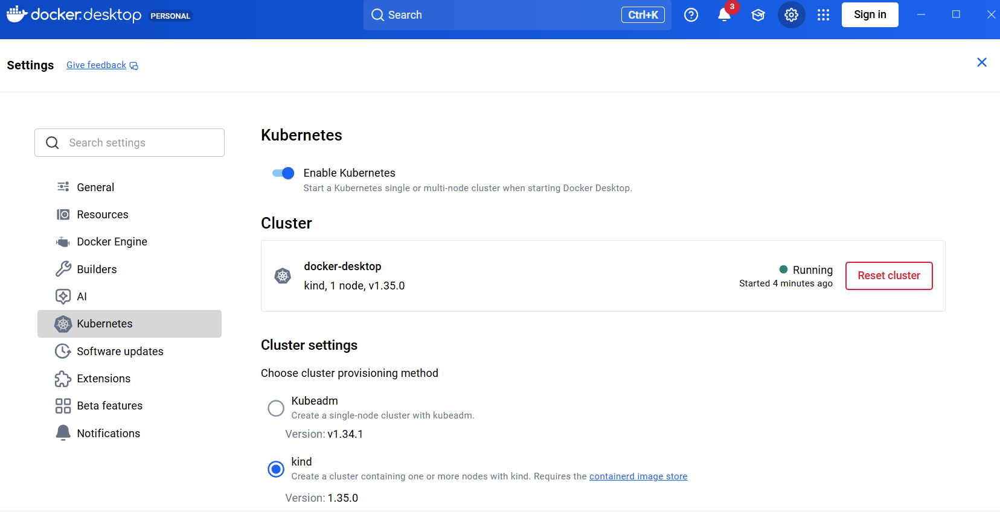

# TP 2 - Docker Kubernetes

> ESGI M1 AL - Serverless Architectures Cloud

## Préparation (sur Windows WSL2 -> Ubuntu)

- vérifier WSL2 et docker desktop installés
```powershell
wsl -v

Version WSL : 2.6.3.0
Version du noyau : 6.6.87.2-1
...

wsl -l -v

  NAME              STATE           VERSION
* Ubuntu            Running         2
  docker-desktop    Running         2
```

- vérifier kubectl installé (instalation via docker desktop, les commandes sont exposées dans WSL2/Ubuntu)
```bash
kubectl version --client
# ->
Client Version: v1.34.1
Kustomize Version: v5.7.1
```


- installation de kind (d'après https://kind.sigs.k8s.io/docs/user/quick-start/#installation)
```bash
[ $(uname -m) = x86_64 ] && curl -Lo ./kind https://kind.sigs.k8s.io/dl/v0.31.0/kind-linux-amd64
chmod +x ./kind
sudo mv ./kind /usr/local/bin/kind
```

```bash
kind version
# ->
kind v0.31.0 go1.25.5 linux/amd64
```


- installer kn (CLI Knative) (https://kubernetes.io/docs/tasks/knative/install-kn-cli/)
```bash
curl -L "https://github.com/knative/client/releases/download/knative-v1.21.0/kn-linux-amd64" -o kn
chmod +x kn
sudo mv kn /usr/local/bin/kn
```

- installer plugin quickstart (https://github.com/knative-sandbox/kn-plugin-quickstart/releases/)
```bash
curl -L "https://github.com/knative-sandbox/kn-plugin-quickstart/releases/download/knative-v1.20.0/kn-quickstart-linux-amd64" -o kn-quickstart
chmod +x kn-quickstart
sudo mv kn-quickstart /usr/local/bin/kn-quickstart
```

## Cluster Knative + service serverless

- créer un cluster knative avec quickstart
```bash
kn quickstart kind

# ->

Running Knative Quickstart using Kind
✅ Checking dependencies...
    Kind version is: 0.31.0

A local registry is no longer created by default.
    To create a local registry, use the --registry flag.

☸ Creating Kind cluster...
Creating cluster "knative" ...
 ✓ Ensuring node image (kindest/node:v1.32.0) 🖼
 ✓ Preparing nodes 📦
 ✓ Writing configuration 📜
 ✓ Starting control-plane 🕹️
 ✓ Installing CNI 🔌
 ✓ Installing StorageClass 💾
 ✓ Waiting ≤ 2m0s for control-plane = Ready ⏳
 • Ready after 18s 💚
Set kubectl context to "kind-knative"
You can now use your cluster with:

kubectl cluster-info --context kind-knative

Thanks for using kind! 😊

🍿 Installing Knative Serving v1.20.0 ...
    CRDs installed...
    Core installed...
    Waiting for webhook to be ready...
    Webhook is ready...
    Finished installing Knative Serving
🕸️ Installing Kourier networking layer v1.20.0 ...
    Kourier installed...
    Ingress patched...
    Finished installing Kourier Networking layer
🕸️ Configuring Kourier for Kind...
    Kourier service installed...
    Domain DNS set up...
    Finished configuring Kourier
🔥 Installing Knative Eventing v1.20.0 ...
    CRDs installed...
    Core installed...
    In-memory channel installed...
    Mt-channel broker installed...
    Example broker installed...
    Finished installing Knative Eventing
🚀 Knative install took: 4m49s
🎉 Now have some fun with Serverless and Event Driven Apps!
```

- Créer un service conteneurisé (nodejs)
```bash
tree .
# ->
.
├── Dockerfile
├── index.js
└── package.json
```

- Construire l'image docker
```bash
docker build -t campus-fn:v0.1.0 .
```

- On charger l'image dans le cluster kind
```bash
kind load docker-image campus-fn:v0.1.0 --name knative
```

- Déployer le service knative
```bash
kn service create campus-fn \
  --image campus-fn:v0.1.0 \
  --port 8080 \
  --env VERSION=v0.1.0
```
> Service 'campus-fn' created to latest revision 'campus-fn-00001' is available at URL:
> http://campus-fn.default.127.0.0.1.sslip.io

- Tester le service & vérification du zero2scale
```bash
curl "http://campus-fn.default.127.0.0.1.sslip.io/"
# ->
Bonjour depuis Campus FN - v0.1.0
```

```bash
kubectl get pods
# ->
# si le service n'a pas été appelé récemment, il n'y a pas de pod en cours d'exécution
No resources found in default namespace.
# sinon (après un curl), on voit le pod créé           
NAME                                         READY   STATUS    RESTARTS   AGE
campus-fn-00001-deployment-dd6765766-mrphp   2/2     Running   0          7s
```

## Orchestration déploiement : canary (traffic splitting)

- On builde une nouvelle version de l'application et on la charge dans le cluster
```bash
docker build -t campus-fn:v0.2.0 .
kind load docker-image campus-fn:v0.2.0 --name knative
```

- On met à jour le service knative avec la nouvelle image pour créer une nouvelle révision
```bash
kn service update campus-fn \
  --image campus-fn:v0.2.0 \
  --env VERSION=v0.2.0
```

> On peut identifier les révisions avec :
```bash
kn revision list campus-fn
# ->
NAME              SERVICE     TRAFFIC   TAGS   GENERATION   AGE     CONDITIONS   READY   REASON
campus-fn-00002   campus-fn   100%             2            66s     3 OK / 4     True    
campus-fn-00001   campus-fn                    1            7m22s   3 OK / 4     True   
```

- On configure le traffic splitting (90% / 10%) (v0.1.0 / v0.2.0)
```bash
kn service update campus-fn \
  --traffic campus-fn-00001=90 \
  --traffic campus-fn-00002=10
```

> Détaid de kn revision list
```bash
kn revisions list
# ->
NAME              SERVICE     TRAFFIC         TAGS   GENERATION   AGE     CONDITIONS   READY
campus-fn-00002   campus-fn   10%              2            2m26s   3 OK / 4     True    
campus-fn-00001   campus-fn   90%              1            8m42s   3 OK / 4     True  
``` 

> on peut observer que sur une multitude d'appels curl on obtient plus souvent la version 0.1.0 que la 0.2.0
```bash
curl "http://campus-fn.default.127.0.0.1.sslip.io/"
# ->
# v0.1.0
Bonjour depuis Campus FN - v0.1.0
# v0.2.0
Bonjour depuis Campus FN - v0.2.0
```

## Orchestration event-driven : Broker/Trigger + PingSource

- On crée un broker par défaut
```bash
kn broker create default
# ->
Broker 'default' successfully created in namespace 'default'.
```

- On Crée un trigger pour router les événements vers le service campus-fn
```bash
kn trigger create campus-trigger \
  --broker default \
  --sink ksvc:campus-fn
# ->
Trigger 'campus-trigger' successfully created in namespace 'default'.
```

- On crée une source d'événements périodiques (PingSource) qui envoie un événement toutes les minutes
```bash
kn source ping create campus-ping \
  --schedule "*/1 * * * *" \
  --data '{"message": "Hello Knative"}' \
  --sink broker:default

# ->
PingSource 'campus-ping' successfully created in namespace 'default'.
```

- On peut alors observer les événements arrivant dans le service campus-fn
```bash
kubectl logs -l serving.knative.dev/service=campus-fn -c user-container -f
# ->
Reçu requête sur v0.1.0
Reçu requête sur v0.1.0
Reçu requête sur v0.1.0
Événement reçu: undefined

> campus-fn@1.0.0 start
> node index.js

Server started on port 8080
Événement reçu: undefined
Événement reçu: undefined
Événement reçu: undefined
Reçu requête sur v0.2.0
Reçu requête sur v0.2.0
```
> (le message "Hello Knative" n'apparaît pas car le code ne le gère pas)

## Résultats

> (comprend `campus-fn-00003` à cause de la tentative de correction du message d'événement)

```bash
kind get clusters
# ->
knative
```

```bash
kn service list
# ->
NAME        URL                                           LATEST            AGE   CONDITIONS   READY   REASON
campus-fn   http://campus-fn.default.127.0.0.1.sslip.io   campus-fn-00003   38m   3 OK / 3     True  
```

```bash
kn revisions list --service campus-fn
# ->
NAME              SERVICE     TRAFFIC   TAGS   GENERATION   AGE   CONDITIONS   READY   REASON
campus-fn-00003   campus-fn   10%              3            11m   3 OK / 4     True    
campus-fn-00002   campus-fn                    2            34m   3 OK / 4     True    
campus-fn-00001   campus-fn   90%              1            40m   4 OK / 4     True   
```